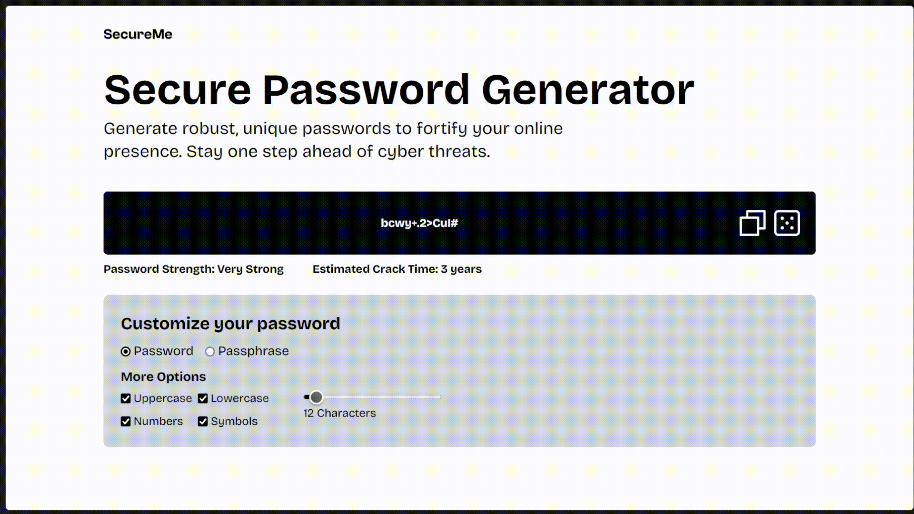
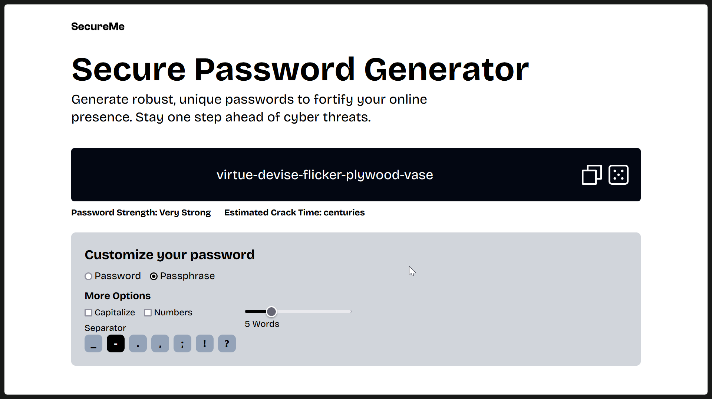
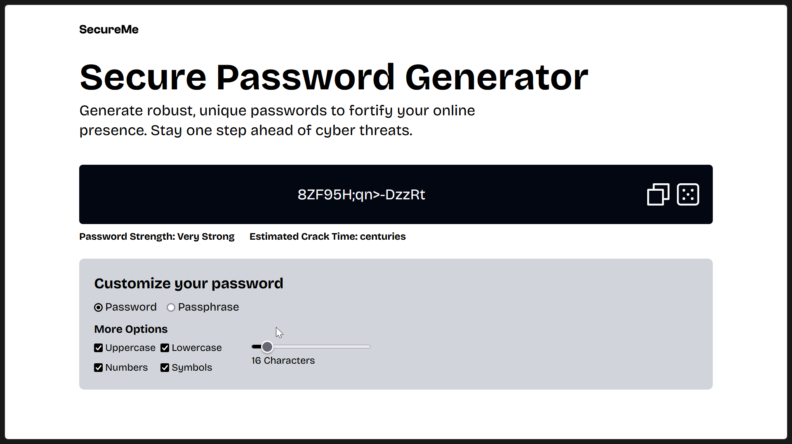
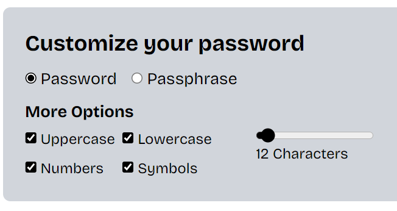
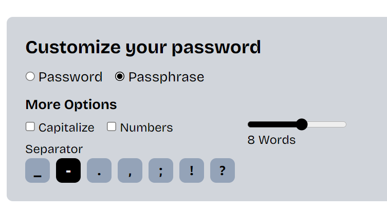
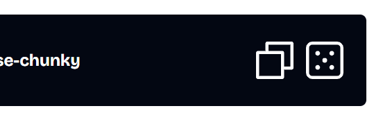

# SecureMe Inc

## Synopsis

A secure password generator web application for a fictional company, SecureMe Inc.

SecureMe Inc. is a cyber-security company that specializes in online security and data protection. They are looking to develop a Python web application that can help users generate strong and unique passwords. In an era of increasing online threats, having a reliable password generator can significantly enhance online security.

## Acknowledgements

- Aptech Computer Education
- Project Members
- Project Mentor

## Demo

The live website can be accessed through this link: [https://secureme-generator.vercel.app/](https://secureme-generator.vercel.app/)



## Run Locally [ Developer's Guide ]

### Clone the project

```bash
git clone https://github.com/CyxAero/secureme.git
```

Or unzip the `secureme-main.zip` in the `Source Code` directory into a folder.
Go to the project directory

```bash
cd secureme
```

### Install frontend dependencies

```bash
cd frontend
npm install
```

Create `.env` file in the frontend directory and add the following

```text
VITE_API_URL=http://localhost:5000/
```

You can use whatever port you choose.

### Install backend dependencies

You should do this in a separate shell.

```bash
cd backend
pip install -r requirements.txt
```

### Setup backend

Open the `app.py` file and uncomment the last two lines

```python
# FOR RUNNING LOCALLY

if __name__ == '__main__':

    app.run(host='0.0.0.0', port=5000, debug=app.config['DEBUG'])
```

### Start servers

Start the backend server

```bash
python -m app
```

Navigate to the shell in the frontend directory and start the server

```bash
npm run dev
```

### Technologies Used

#### Frontend

- React
- Tailwindcss
- Fontsource
- Floating UI
- Dotlottie
- Axios
- Prop-types

#### Backend

- Flask
- Flask-CORS
- Wonderwords
- zxcvbn

---

## Design

### Flowchart


### Process Diagram


## Screenshots





---

## Usage/Examples

Once you load the website on your browser, your password would be automatically generated. If you want to customize your password, you can do so with the provided options. You can also choose to generate a passphrase instead.



Use the regenerate button to keep generating passwords/passphrases until you're satisfied with the output.



Use the copy button to copy the generated password/passphrase to your clipboard and then you can freely paste it wherever you please.

---

## Authors

- [@CyxAero](https://github.com/CyxAero)

## Feedback

If you have any feedback, please reach out to me at <cyxkris6@gmail.com>
